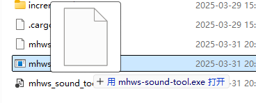

# MHWS Sound Tool

[中文说明](docs/README_zh-CN.md)

## Introduction

This is a simple tool for extracting and editing Wwise Sound Bank (BNK) and PCK files.

Features: Compared to GUI tools like [RingingBloom](https://github.com/Silvris/RingingBloom), `MHWS Sound Tool` is simpler and more user-friendly for advanced users. Furthermore, since it unpacks wem files into project folders, it is better suited for writing scripts to perform batch operations or for use in conjunction with other tools for processing, rather than being limited to the GUI of specific tools.

## Download

Download from [Releases](https://github.com/eigeen/mhws-sound-tool/releases)

## Usage

### Extracting Files and Generate Project Folder

Supported file types:
- Wwise BNK file (designed for v145, but should work with other versions)
- Wwise PCK file

```
mhws-sound-tool.exe <input_file> [<input_file>...]
```

Drag and drop files onto the executable is easier to use.



After that, you can see the generated `project` folder(s) near the input file(s).


Project folder structure like this:
```
<.project>
├── [000]123456.wem
├── [001]2345678.wem
├── ...
├── project.json
├── bnk.json
```

Wem naming rules:
- `[000]` is the sequential index of the sound in the bnk file. The index is not important, just affect the sequential of the sounds inside the bnk file.
- `123456` is the unique ID of the sound file.
- The index is not important, duplications or random numbers are allowed. But you should keep the wem file name structure as `[number]number.wem`, so that the tool can recognize the file.
- The game find the wem by the unique ID, so the ID should be correct.

More convenient file replacement method, refer to [Replace Files](#File-Replacement)

### Packaging Project Folder into Target File

The entire folder should be seen as a project for `MHWS Sound Tool`. You should import the project folder, instead of individual files inside it.


Then you can see the generated target file(s) near the project folder `<original_file_name>.new`.

### Convert Audio to WEM Format

Input one or more audio file paths into the tool to automatically convert them.

*This feature requires `Wwise Console` and optionally depends on `ffmpeg`.*

Supported formats:  
- Requires conversion via `Wwise Console`: `wav`  
- Requires transcoding via `ffmpeg` first, then conversion via `Wwise Console`: `mp3`, `ogg`, `flac`, `aac`

When external tools are required, the tool will first search default paths. If not found:  
- In **interactive mode**, it will prompt for path input.  
- In **CLI mode**, it will throw an error if no parameters are provided.  

Paths entered in interactive mode will be saved to a `config.toml` configuration file in the tool directory. If your paths change, edit this file or delete it to regenerate during the next run.

---

## Extended Features

We provide extended features for common operations to simplify your workflow.

### File Replacement

*Available since v0.2.0.*

Instead of directly replacing original WEM files, you can use the quick replacement feature:  

1. Create a `replace` directory in your project folder.  
2. Place replacement files inside it.  

  
  

File structure example:  
```
<.project>
├── replace
│   ├── [0].wav       # Replaces [000]123456.wem
│   └── 2345678.mp3   # Replaces [001]2345678.wem
├── [000]123456.wem
├── [001]2345678.wem
├── ...
├── project.json
└── bnk.json
```

Supported replacement file formats:  
- Direct replacement: `wem`  
- Requires conversion via `Wwise Console`: `wav`  
- Requires transcoding via `ffmpeg` first: `mp3`, `ogg`, `flac`, `aac`  

Replacement file naming rules:  
- To replace a WEM file by **sequential index** (e.g., 001, 129, 76): Name as `[<index>]` (square brackets required).  
- To replace a WEM file by **unique ID** (e.g., 123456, 203598950): Name as `<ID>` (no square brackets).  
- Example: `[3]` targets the 4th sequential file, while `987654` targets the file with ID 987654.