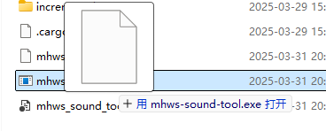
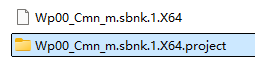
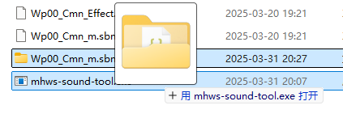

# MHWS Sound Tool

## 介绍

一个用于提取和编辑 Wwise BNK和 PCK 文件的简单工具。

特点：相比于 [RingingBloom](https://github.com/Silvris/RingingBloom) 等GUI工具，`MHWS Sound Tool`更简单易用。并且由于它将文件解包为工程文件夹，更适合自己编写脚本进行批量操作，或配合其它工具进行处理，而不是局限于特定工具的GUI中操作。

## 下载

在 [Releases](https://github.com/eigeen/mhws-sound-tool/releases) 下载。

## 使用说明

### 解包文件，生成工程文件夹

支持以下文件类型：

- Wwise BNK 文件（基于v145设计，但应该适用于其他版本）
- Wwise PCK 文件

```
mhws-sound-tool.exe <input_file> [<input_file>...]
```

拖放文件到exe上更方便使用。



之后，会在输入文件旁边生成一个工程文件夹。



工程文件夹结构如下：

```
<.project>
├── [000]123456.wem
├── [001]2345678.wem
├── ...
├── project.json
├── bnk.json
```

Wem命名规则：

- `[000]` 是音频的顺序索引。顺序无关紧要，只影响音频在BNK文件里的存放顺序。
- `123456` 是音频文件的唯一ID。
- 顺序ID无关紧要，可以重复或随机。但必须保证wem文件名结构为`[数字]数字.wem`，以便工具能够识别文件。
- 游戏通过唯一ID查找wem，所以唯一ID必须正确。

### 打包工程文件夹为目标文件

对于工具来说，整个工程文件夹是一个整体。不要拖放到工程文件夹里的wem文件，而是拖放整个工程文件夹。



之后，会在工程文件夹旁边生成一个新的文件，文件名默认为`<原文件名>.new`。
