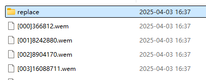
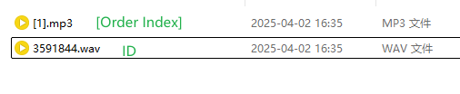

# MHWS Sound Tool

## 介绍

一个用于提取和编辑 Wwise BNK和 PCK 文件的简单工具。

特点：相比于 [RingingBloom](https://github.com/Silvris/RingingBloom) 等GUI工具，`MHWS Sound Tool`更简单易用。并且由于它将文件解包为工程文件夹，更适合自己编写脚本进行批量操作，或配合其它工具进行处理，而不是局限于特定工具的GUI中操作。

## 下载

在 [Releases](https://github.com/eigeen/mhws-sound-tool/releases) 下载。

## 使用说明

### 解包文件，生成工程文件夹

支持以下文件类型：
- Wwise BNK 文件（基于v145设计，但应该适用于其他版本）
- Wwise PCK 文件

```
mhws-sound-tool.exe <input_file> [<input_file>...]
```

拖放文件到exe上更方便使用。


之后，会在输入文件旁边生成一个工程文件夹。


工程文件夹结构如下：
```
<.project>
├── [000]123456.wem
├── [001]2345678.wem
├── ...
├── project.json
├── bnk.json
```

Wem命名规则：
- `[000]` 是音频的顺序索引。顺序无关紧要，只影响音频在BNK文件里的存放顺序。
- `123456` 是音频文件的唯一ID。
- 顺序ID无关紧要，可以重复或随机。但必须保证wem文件名结构为`[数字]数字.wem`，以便工具能够识别文件。
- 游戏通过唯一ID查找wem，所以唯一ID必须正确。

更方便的文件替换方法，参考[替换文件](#替换文件)

### 打包工程文件夹为目标文件

对于工具来说，整个工程文件夹是一个整体。不要拖放到工程文件夹里的wem文件，而是拖放整个工程文件夹。


之后，会在工程文件夹旁边生成一个新的文件，文件名默认为`<原文件名>.new`。

### 转码音频为 Wem 格式

将一个或多个音频文件路径输入工具，即可自动转换。

*此功能必须依赖`Wwise Console`，可选依赖`ffmpeg`。*

支持格式：
- 需要通过`Wwise Console`转换：`wav`
- 需要先通过`ffmpeg`转码，再通过`Wwise Console`转换：`mp3`, `ogg`, `flac`, `aac`

当需要调用外部工具时，会先尝试从默认路径搜索，如果未找到：
- 在交互式模式下会提示输入路径。
- Cli模式下如果未传参则会报错。

交互式模式输入的路径会被保存在工具同一目录下的`config.toml`配置文件中。如果您的路径更改，请编辑配置文件，或删除该文件，等待下次重新生成。

---

## 扩展功能

我们为常用功能准备了一些扩展功能，也许可以方便你进行一些便捷的操作。

### 替换文件

*此功能在v0.2.0后可用。*

除了直接替换原本的wem文件，你还可以使用快捷替换功能：

1. 在工程文件夹内创建一个`replace`目录。
2. 将你的替换文件放在里面。




文件结构如下：
```
<.project>
├── replace
│   ├── [0].wav       # 将会替换[000]123456.wem
│   └── 2345678.mp3   # 将会替换[001]2345678.wem
├── [000]123456.wem
├── [001]2345678.wem
├── ...
├── project.json
└── bnk.json
```

替换文件支持格式：
- 直接替换：`wem`
- 需要通过`Wwise Console`转换：`wav`
- 需要先通过`ffmpeg`转码：`mp3`, `ogg`, `flac`, `aac`

替换文件命名规则：
- 如果要替换某一个**顺序Index**的Wem文件（如001，129，76）：需要命名为 `[<顺序Index>]`，方括号是必须的。
- 如果要替换某一个**唯一ID**的Wem文件（如123456，203598950）：需要命名为 `<唯一ID>`，此时不能加方括号。
- 例如：`[3]`替换顺序索引为3（第4个）的Wem文件，`987654`替换唯一ID为987654的Wem文件。
